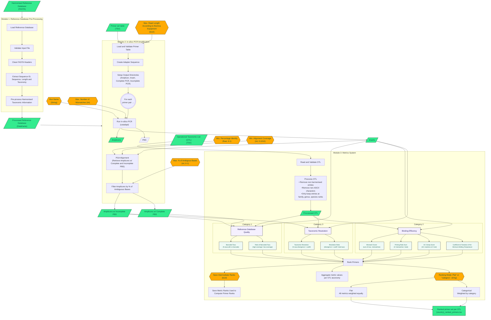

# mozaiko: A Multi-Metric Ranking Framework For Metabarcoding

[](https://www.gnu.org/licenses/gpl-3.0)
[](https://github.com/CIBIO-BU/mozaiko/actions/workflows/super-linter.yml)
[](https://github.com/CIBIO-BU/mozaiko/actions/workflows/python-test-check.yml)
[](https://codecov.io/gh/CIBIO-BU/mozaiko)


Mozaiko is a bioinformatics tool for ranking primer sets for biomonitoring studies. It evaluates primer performance based on reference database representation, primer-binding efficiency, and taxonomic coverage for a user-defined list of taxa, helping researchers identify the most suitable primer sets for reliable and comparable genetic marker analyses.

## Table of contents

- [Installation](#installation)
- [Quick start](#quick-start)
- [Repository structure](#repository-structure)
- [Input formats](#input-formats)
- [mozaiko Metrics System](#mozaiko-metrics-system)
- [Ranking Framework](#ranking-framework)
- [mozaiko Workflow](#mozaiko-workflow)
- [Contacts](#contacts)

## Installation

### Standard installation (recommended)

mozaiko is available on Bioconda. You can add it to an environment through:

   ```bash
   conda install bioconda::mozaiko
   ```
This installs mozaiko and all required dependencies, including **cutadapt**, **vsearch**, **catnip**, and **crabs**.

### Development installation

If you want to contribute to mozaiko or run it from source, follow the steps below.

#### Prerequisites:

- Python ≥ 3.11
- Conda (Miniconda or Anaconda)
- Git

1. Clone the repository:

   ```bash
   git clone git@github.com:CIBIO-BU/mozaiko.git
   ```
      ```bash
   cd mozaiko
   ```

2. Run the installation script:

   ```bash
   chmod +x conda_env_setup.sh
   ```
      ```bash
   ./conda_env_setup.sh
   ```

3. Activate the environment:

      ```bash
   conda activate mozaiko
   ```

4. Run mozaiko:

      ```bash
   mozaiko --help
   ```

The installation script will check whether Conda is installed, create a **mozaiko** environment from **environment.yml**, install the mozaiko package in editable mode, and install additional required tools (**CRABS v0.1.7**, **cutadapt**, **vsearch**, **catnip**).

## Quick Start

The mozaiko recommendede pipeline can be run via **Python scripts** or driven by a **JSON configuration file through CLI**.

- For **Python scripts**, two example workflow scripts are included in the repository root, one for macroinvertebrates (_workflow_bmi.py_) and one for diatoms (_workflow_dia.py_). To evaluate a single OTL instead of a whole folder, use `MetricsSystemExecutor.evaluate_single_OTL()` with the same keyword arguments plus `otl_path`.
- For **CLI runs**, mozaiko can also be entirely run through a config file. Run `mozaiko run-pipeline --config file.json`. See _example_config_run.json_ in the repository root for a template JSON file.


## Repository structure

   ```
mozaiko/
├── src/mozaiko/
│   ├── reference_database/
│   │   ├── sequence_import.py     # CustomFastaImport: FASTA loading & pre-processing
│   │   └── db_curation.py         # CrabsScriptGenerator: taxonomy assignment & dereplication via CRABS
│   ├── in_silico_analysis/
│   │   └── amplification.py       # InSilicoAmplification: cutadapt + PGA amplification pipeline
│   ├── marker_scoring/
│   │   ├── metrics_system.py      # OtlHandler, ReferenceDatabaseQuality, Binding,TraitsAndResolution, MetricsSystemExecutor
│   │   ├── scoring_utils.py       # IUPAC mismatch calculation, PBS extraction, sequence filtering
│   │   └── aux_analysis.py        # Sequence count tracking across pipeline steps
│   └── mozaiko.py                 # mozaiko CLI
├── tests/                         # unittest test suites, mirroring the src/ module structure
├── data/
│   ├── input_data/                # Example input files (FASTA, primer tables, OTLs)
│   ├── output_data/               # Pipeline outputs (gitignored)
│   └── images/                    # Logo and documentation assets
├── external_scripts/              # Bundled CRABS v0.1.7 archive
├── .github/workflows/             # CI: linting (super-linter) and test checks
├── workflow_bmi.py                # End-to-end example run for macroinvertebrates (BMI)
├── workflow_dia.py                # End-to-end example run for diatoms (DIA)
├── example_config_run.json        # Config template for JSON-driven CLI runs
├── environment.yml                # Conda environment specification
├── conda_env_setup.sh             # Automated environment installer (development)
├── pyproject.toml                 # Package metadata and build configuration
└── mypy.ini                       # Static type checking configuration
   ```
The three pipeline modules map directly onto the three subpackages/files in `src/mozaiko/`:

| Module | Folder | Entry point | External tools |
|--------| ------- |-------------|----------------|
| Reference Database Import | reference_database |`CustomFastaImport` | — |
| In Silico Amplification | in_silico_analysis | `InSilicoAmplification` | cutadapt, CRABS, PGA (vsearch) |
| Metrics Evaluation | marker_scoring | `MetricsSystemExecutor` | CATNIP |


## Input formats

### Reference database (FASTA)

The input FASTA must contain harmonised taxonomic information in the sequence headers. Each header should follow the format:

```
>sequenceID|original tax information|ScientificName|rank|kingdom|phylum|class|order|family|genus|species
```

Users can harmonise the input FASTA through the python script [tax_harmonize.py](https://github.com/CIBIO-BU/DNAquaIMG/blob/main/tax_harmonize.py), by running:

```
python tax_harmonize.py --database your_file.fasta
```

For this step, your fasta file must contain:

```
>sequenceID|original tax information
```

### Primer table (TSV)

The primer table must be a tab-separated file with the following columns:

| Column | Description |
|--------|-------------|
| `target_group` | Taxonomic group targeted by the primer pair |
| `barcode_region` | Target barcode region (e.g. COI, 16S) |
| `assay_name` | Unique identifier for the primer pair |
| `fwd_seq` | Forward primer sequence (5′→3′) |
| `rev_seq` | Reverse primer sequence (5′→3′) |

Users can also add information regarding `min_read_length` and `max_read_length`. These values can also be determined automatically by the tool, by running in-silico PCR amplification with the `max_len_according_to_illumina` parameter as `True`.

### Operational Taxonomic List (OTL, TSV)

The OTL defines the set of taxa against which primers are evaluated. It must be a tab-separated file containing at minimum the following columns:

| Column | Description |
|--------|-------------|
| `taxa` | Scientific name of the taxon |
| `rank` | Taxonomic rank (`family`, `genus`, or `species`) |
| `family` | Family-level classification |
| `genus` | Genus-level classification |
| `species` | Species-level classification |

Entries with ranks above family (kingdom, phylum, class, order) are automatically excluded during pre-processing. One OTL file per country/region is expected; the filename stem is used as the country identifier in output files (e.g. `Germany_taxonlist.tsv` → `Germany_ranked_primers.tsv`).

Users can harmonise the input OTL through the python script [tax_harmonize.py](https://github.com/CIBIO-BU/DNAquaIMG/blob/main/tax_harmonize.py), by running:

```
python tax_harmonize.py --otl your_file.tsv
```

For this step, your TSV file must contain at least one column named `taxa`.

## mozaiko Metrics' System

mozaiko contains three main categories to evaluate and rank primer sets:

### **Category 1:** Reference Database Quality

- **Barcoded Taxa**: percentage of taxa in OTL with more than one barcode. A barcode must include the target insert to be considered.
- **Ratio of Barcoded Taxa**: proportion of taxa in OTL with high barcode coverage (more than five barcodes) relative to taxa with minimal barcode coverage (at least one barcode). The value ranges from 0 to 1, 1 representing the optimal scenario.

### **Category 2:** Binding

- **Mismatch Score**: the maximum number of mismatches between the forward primer and its binding site and the reverse primer and its binding site is recorded for each taxon. The maximum mismatch values are then summed to provide the score for the OTL list. The lowest values indicate lower mismatches between primer and primer-binding sites, facilitating amplification.
- **Priming Ratio Sum**: sum of the priming ratio across taxon. The priming ratio is computed as the ratio of the maximum number of mismatches at the 3’ end of the primer binding site to the maximum number of mismatches across the entire primer binding site. The lowest values indicate fewer mismatches at the 3’ end of the primer binding site, hence higher binding strength.
- **GC Clamp Score**:  sum of GC matches at the 3’ end (GC Clamp) across all taxa present in the OTL. Higher values are preferable, as a content of 40-60% of GC matches promotes binding.
- **Coefficient of Variation of the Minimum Melting Temperature**: The minimum melting temperature (Tm) between each pair of forward and reverse primers is calculated for each taxon. The coefficient of variation across taxa is then determined. Lower values indicate a more consistent thermal performance and are preferable.

### **Category 3:** Traits and Resolution

- **Taxonomic Resolution**: percentage of taxa whose genetic divergence is higher than the cutoff (default cutoffs are 10%, 5%, and 2% for families, genus, and species, respectively). Higher values are preferable as they indicate an increased possibility of distinguishing between closely related taxa.
- **Resolution Ratio**: percentage of taxa with genetic divergence higher than a cutoff (default cutoffs are 10%, 5%, and 2% for families, genus, and species, respectively), divided by the total number of taxa considered. This metric indicates the primer's ability to distinguish the target taxonomy from non-target taxa.

### Ranking Framework

### How metrics are scored

The final ranking position is determined based on the individual ranking scores for each metric, presented in the output file *{prefix}__intermediate_ranks.tsv_*, with all metrics weighted equally. Each metric is ranked based on whether higher or lower values are more desirable:
   - Descending:
      - Barcoded Taxa
      - Ratio of Barcoded Taxa
      - GC Clamp Score
      - Taxonomic Resolution
      - Resolution Ratio
   - Ascending:
      - Mismatch Score
      - Priming Ratio Sum
      - Coefficient of Variation of the Minimum Melting Temperature

For metrics ranked ascending, primers with lower values are preferred. For example, a lower Mismatch Score is better because it means fewer mismatches. For metrics ranked descending, primers with higher values are preferred.

### Ranking modes

mozaiko supports two ranking strategies, controlled by the `ranking_mode` parameter:

- **`"flat"`** — each individual metric is weighted equally. All metrics contribute the same amount to the final rank regardless of which category they belong to. This mode is useful when there is no prior reason to privilege one aspect of primer performance over another.

- **`"category"`** — metrics are first aggregated within each of the three categories (Reference Database Quality, Binding Efficency, Taxonomic Resolution), and the three category scores are then weighted equally to produce the final rank. This prevents categories with more metrics (such as Binding Efficency) from dominating the result simply by virtue of having more contributors.

## mozaiko Workflow

> **Note:** The tool assumes that the reference database and the taxonomic identifications it contains are correct. Primer rankings are always relative to a specific run — adding or removing primers from the input table will change the results.




## Contacts

In case of enquiry, please reach out to <bu@biopolis.up.pt>.
