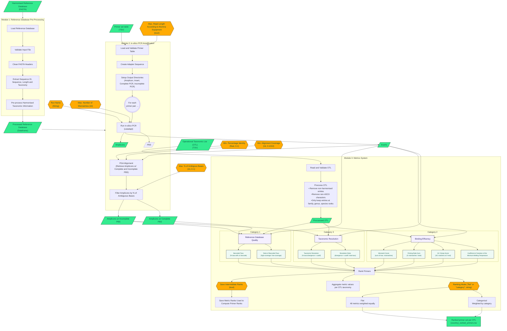

# mozaiko: Piecing Together Complete Genetic Coverage for Biomonitoring

[](https://www.gnu.org/licenses/gpl-3.0)
[](https://github.com/CIBIO-BU/mozaiko/actions/workflows/super-linter.yml)
[](https://github.com/CIBIO-BU/mozaiko/actions/workflows/python-test-check.yml)
[](https://codecov.io/gh/CIBIO-BU/mozaiko)


Mozaiko is a bioinformatics tool for ranking primer sets for biomonitoring studies. It evaluates primer performance based on reference database representation, primer-binding efficiency, and taxonomic coverage for a user-defined list of taxa, helping researchers identify the most suitable primer sets for reliable and comparable genetic marker analyses.

## Installation instructions

### Prerequisites

- Python 3.x
- Conda (Miniconda or Anaconda)
- Git

### Installation

1. Clone the repository:

   ```bash
   git clone git@github.com:CIBIO-BU/mozaiko.git
   ```
      ```bash
   cd mozaiko
   ```

2. Run the installation script:

   ```bash
   chmod +x conda_env_setup.sh
   ```
      ```bash
   ./conda_env_setup.sh
   ```

3. Activate the environment:

      ```bash
   conda activate mozaiko
   ```

3. Run mozaiko:

      ```bash
   mozaiko --help
   ```

Th installation script will:

- Check if Conda is installed;
- Create a new Conda environment named "mozaiko", if it does not yet exist;
- Activate the Conda environment;
- Install the mozaiko package;
- Install required dependencies and tools.

## mozaiko Metrics' System

mozaiko contains three main categories to evaluate and rank primer sets:

### **Category 1:** Reference Database Quality

- **_barcoded_taxa_one_plus_**: percentage of taxa in OTL with more than one barcode. A barcode must include the target insert to be considered.
- **_ratio_barcoded_taxa_**: proportion of taxa in OTL with high barcode coverage (more than five barcodes) relative to taxa with minimal barcode coverage (at least one barcode). The value ranges from 0 to 1, 1 representing the optimal scenario.

### **Category 2:** Binding

- **_mismatch_score_**: the maximum number of mismatches between the forward primer and its binding site and the reverse primer and its binding site is recorded for each taxon. The maximum mismatch values are then summed to provide the score for the OTL list. The lowest values indicate lower mismatches between primer and primer-binding sites, facilitating amplification.
- **_priming_ratio_sum_**: sum of the priming ratio across taxon. The priming ratio is computed as the ratio of the maximum number of mismatches at the 3’ end of the primer binding site to the maximum number of mismatches across the entire primer binding site. The lowest values indicate fewer mismatches at the 3’ end of the primer binding site, hence higher binding strength.
- **_gc_clamp_score_**:  sum of GC matches at the 3’ end (GC Clamp) across all taxa present in the OTL. Higher values are preferable, as a content of 40-60% of GC matches promotes binding.
- **_min_tm_cv_**: The minimum melting temperature (Tm) between each pair of forward and reverse primers is calculated for each taxon. The coefficient of variation across taxa is then determined. Lower values indicate a more consistent thermal performance and are preferable.

### **Category 3:** Traits and Resolution

- **_taxonomic_resolution_**: percentage of taxa whose genetic divergence is higher than 2%. Higher values are preferable as they indicate an increased possibility of distinguishing between closely related taxa.
- **_resolution_ratio_**: percentage of taxa with genetic divergence higher than a cutoff (default cutoffs are 10%, 5%, and 2% for families, genus, and species, respectively), divided by the total number of taxa considered. This metric indicates the primer's ability to distinguish the target taxonomy from non-target taxa.


The final ranking position is determined based on the individual ranking scores for each metric, presented in the output file intermediate_ranks, with all metrics weighted equally. Each metric is ranked based on whether higher or lower values are more desirable:
   - Descending (higher is better):
      - barcoded_taxa_one_plus
      - ratio_barcoded_taxa
      - gc_matches_across_taxon
      - tm_score
      - amplification_success_percent
   - Ascending (lower is better):
      - mismatch_score
      - priming_ratio_sum
      - min_tm_cv
      - taxonomic_resolution

For metrics ranked ascending, primers with lower values are preferred. For example, a lower ‘mismatch_score’ is better because it means fewer mismatches. For metrics ranked descending, primers with higher values are preferred.

## mozaiko Workflow

- The tool assumes that the Reference Database used as input, as well as the taxonomic indetification declared are correct.
- Primer rankings are always relative to a specific run, if different primers are given the results will vary.




## Contacts

In case of enquiry, please reach out to <bu@biopolis.up.pt>.
