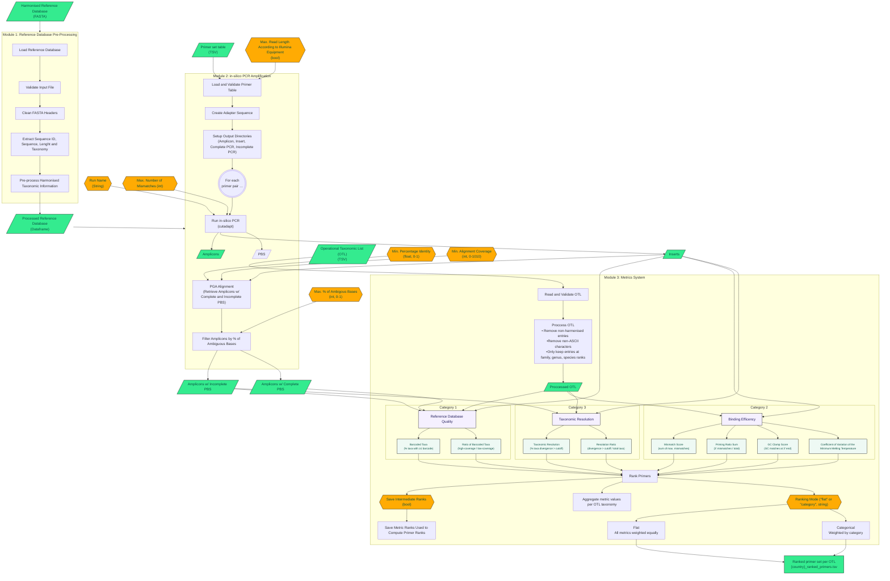

```mermaid
flowchart TD

    %% ─────────────────────────────────────────────
    %% INPUTS+OUTPUTS
    %% ─────────────────────────────────────────────
    FASTA@{ shape: lean-r, label: "Harmonised Reference Database\n(FASTA)"}
    PRIMERS@{ shape: lean-r, label: "Primer set table\n(TSV)"}
    OTL@{ shape: lean-r, label: "Operational Taxonomic List (OTL)\n(TSV)"}
    RNAME{{"Run Name\n (String)"}}
    HRMRFDB@{ shape: lean-r, label: "Processed Reference Database\n (Dataframe)"}
    NMM{{"Max. Number of Mismatches (int)"}}
    MPI{{"Min. Percentage Identity\n(float, 0-1)"}}
    MAC{{"Min. Alignment Coverage\n(int, 0-1010)"}}
    MAP{{"Max. % of Ambigous Bases\n(int, 0-1)"}}
    MAXILUM{{"Max. Read Length According to Illumina Equipment\n(bool)"}}
    AMP@{ shape: lean-r, label: "Amplicons"}
    INST@{ shape: lean-r, label: "Inserts"}
    INCMP@{ shape: lean-r, label: "Amplicons w/ Incomplete PBS"}
    COMP@{ shape: lean-r, label: "Amplicons w/ Complete PBS"}

    %% ─────────────────────────────────────────────
    %% STAGE 1 — DATA IMPORT
    %% ─────────────────────────────────────────────
    subgraph S1["Module 1: Reference Database Pre-Processing"]
        LD["Load Reference Database"]
        VAL["Validate Input File"]
        CLNHD["Clean FASTA Headers"]
        EXTTX["Extract Sequence ID, Sequence, Lenght and Taxonomy"]
        HARMONIZE["Pre-process Harmonised Taxonomic Information"]
    end

    FASTA --> S1
    LD --> VAL --> CLNHD --> EXTTX --> HARMONIZE --> HRMRFDB

    %% ─────────────────────────────────────────────
    %% STAGE 2 — IN SILICO AMPLIFICATION
    %% ─────────────────────────────────────────────
    subgraph S2["Module 2: in-silico PCR Amplification"]
        LDPT["Load and Validate Primer Table"]
        CRTADAPT["Create Adapter Sequence"]
        SETUP["Setup Output Directories\n(Amplicon, Insert, Complete PCR, Incomplete PCR)"]
        INSIL["Run in-silico PCR\n (cutadapt)"]
        LOOP@{ shape: dbl-circ, label: "For each\nprimer pair …"}
        PGA["PGA Alignment\n(Retrieve Amplicons w/ Complete and Incomplete PBS)"]
        FILTER_PBS["Filter Amplicons by % of Ambiguous Bases"]
        AMP@{ shape: lean-r, label: "Amplicons"}
        PBS@{ shape: lean-r, label: "PBS"}
    end

    HRMRFDB --> S2
    PRIMERS --> LDPT
    LDPT --> CRTADAPT
    CRTADAPT --> SETUP
    SETUP --> LOOP
    LOOP --> INSIL
    RNAME --> INSIL
    NMM --> INSIL
    MPI --> PGA
    MAC --> PGA
    MAXILUM --> LDPT
    INSIL --> AMP
    INSIL --> INST
    INST --> PGA
    INSIL --> PBS
    PGA --> FILTER_PBS
    MAP --> FILTER_PBS
    FILTER_PBS --> INCMP
    FILTER_PBS --> COMP


    %% ─────────────────────────────────────────────
    %% STAGE 3 — METRICS EVALUATION
    %% ─────────────────────────────────────────────
    subgraph S3["Module 3: Metrics System"]

        LOAD_OTL["Read and Validate OTL"]
        OTL_PROC["Proccess OTL\n• Remove non-harmonised entries\n•Remove non-ASCII characters\n•Only keep entries at family, genus, species ranks"]
        OTL_IN@{ shape: lean-r, label: "Proccessed OTL"}

        subgraph CAT1["Category 1"]
            RDQ["Reference Database Quality"]
            M1A["Barcoded Taxa\n(% taxa with ≥1 barcode)"]
            M1B["Ratio of Barcoded Taxa\n(high-coverage / low-coverage)"]
            RDQ --> M1A & M1B
        end

        subgraph CAT2["Category 2"]
            BIND["Binding Efficency"]
            M2A["Mismatch Score\n(sum of max. mismatches)"]
            M2B["Priming Ratio Sum\n(3′ mismatches / total)"]
            M2C["GC Clamp Score\n(GC matches at 3′ end)"]
            M2D["Coefficient of Variation of the Minimum Melting Temperature"]
            BIND --> M2A & M2B & M2C & M2D
        end

        subgraph CAT3["Category 3"]
            CATNIP["Taxonomic Resolution"]
            M3A["Taxonomic Resolution\n(% taxa divergence > cutoff)"]
            M3B["Resolution Ratio\n(divergence > cutoff / total taxa)"]
            CATNIP --> M3A & M3B
        end

        RANK["Rank Primers"]
        RNKMD{{"Ranking Mode (&quot;flat&quot; or &quot;category&quot;, string)"}}
        FLAT["Flat\nAll metrics weighted equally"]
        CATW["Categorical\nWeighted by category"]
        SCINTM{{"Save Intermediate Ranks (bool)"}}
        INTER["Save Metric Ranks Used to Compute Primer Ranks"]
        SORT["Aggregate metric values per OTL taxonomy"]

        OTL_IN --> RDQ & BIND & CATNIP

    end

    OTL --> LOAD_OTL
    LOAD_OTL --> OTL_PROC
    OTL_PROC --> OTL_IN
    INST & COMP & INCMP --> RDQ
    INST --> BIND
    INST & INCMP --> CATNIP

    %% ─────────────────────────────────────────────
    %% STAGE 4 — RANKING
    %% ─────────────────────────────────────────────


    M1A & M1B --> RANK
    M2A & M2B & M2C & M2D --> RANK
    M3A & M3B --> RANK

    RANK --> SCINTM
    SCINTM --> INTER
    RANK --> SORT
    RANK --> RNKMD
    RNKMD --> FLAT
    RNKMD --> CATW


    %% ─────────────────────────────────────────────
    %% OUTPUT
    %% ─────────────────────────────────────────────
    FLAT & CATW --> RESULT["Ranked primer set per OTL\n{country}_ranked_primers.tsv"]

    %% ─────────────────────────────────────────────
    %% STYLING
    %% ─────────────────────────────────────────────
    classDef inout     fill:#34eb8f,stroke:#000000,color:#085041,font-weight:500
    classDef param  fill:#FFAB03,stroke:#000000,color:#085041
    classDef stage2    fill:#fff8e6,stroke:#000000,color:#633806
    classDef stage3    fill:#f5f0ff,stroke:#000000,color:#26215c
    classDef stage4    fill:#fef6f0,stroke:#000000,color:#4a1b0c
    classDef metric    fill:#eef9f4,stroke:#000000,color:#085041,font-size:12px
    classDef decision  fill:#faeeda,stroke:#000000,color:#412402
    classDef explain  fill:#34eb8f,stroke:#000000,color:#085041
    classDef metpy  fill:#e7f268,stroke:#000000,color:#085041

    class FASTA,PRIMERS,OTL,RNAME,RESULT,HRMRFDB,NMM,AMP,INST,INCMP,COMP,OTL_IN inout
    class NMM,RNAME,MPI,MAC,MAP,MAXILUM,RNKMD,SCINTM param
    class RDQ,BIND,CATNIP stage3
    class M1A,M1B,M2A,M2B,M2C,M2D,M3A,M3B metric
```